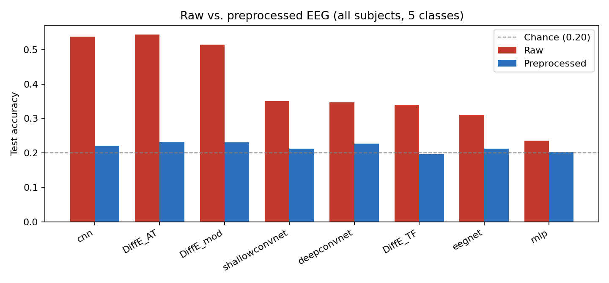
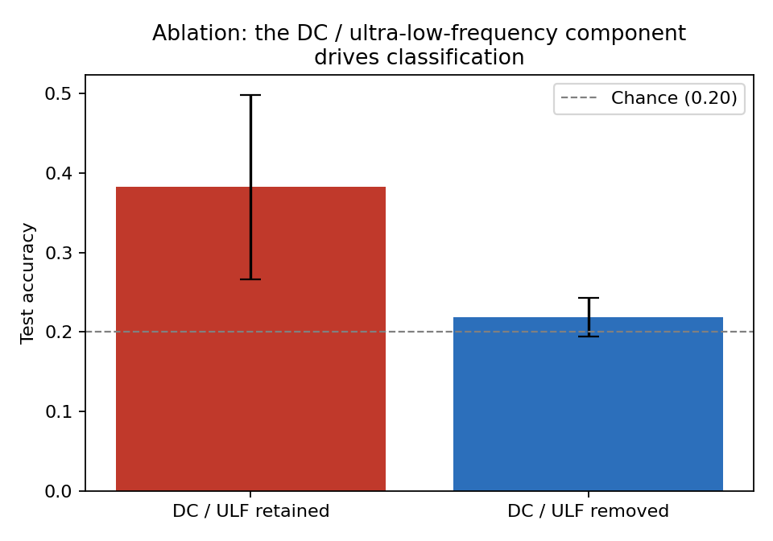
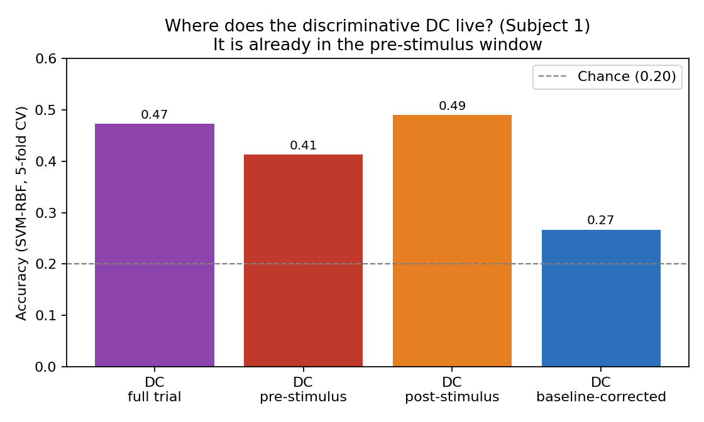
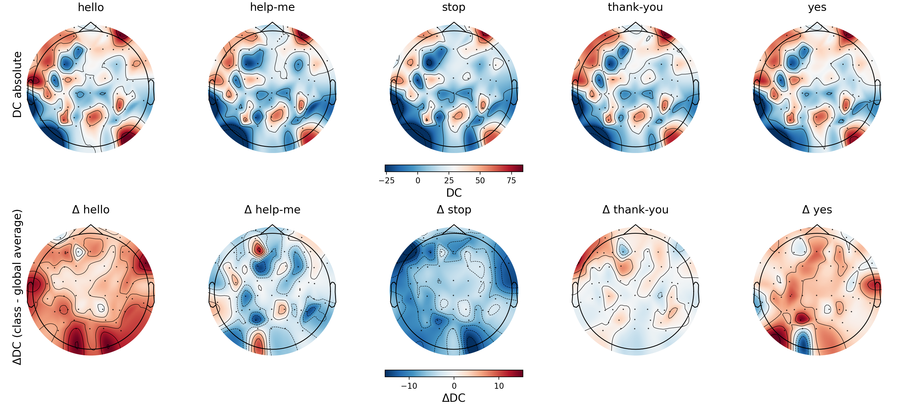

<div align="center">

# Silent Speech Decoding from EEG

### Preprocessing, ultra-low-frequency components, and the DC-offset confound

<p>
  
  
  
  
  
  
</p>

A systematic study of how EEG preprocessing shapes imagined-speech (silent-speech) decoding on the BCI Competition 2020 Track 3 dataset, across eight neural architectures.

MSc Thesis in Neurotechnology, Universidad Politecnica de Madrid (2025) &nbsp;·&nbsp; <a href="docs/thesis.pdf">Read the full thesis (PDF)</a>

</div>

---

> **Key result.** On this dataset, models trained on *raw* EEG beat the same models trained on standard *preprocessed* EEG. The gap is almost entirely explained by the per-trial **DC offset**: a plain SVM using only the DC classifies the five words as well as the deep models. A follow-up analysis shows that this DC signal is already present *before the stimulus*, so it cannot be a neural correlate of the imagined word. In short, a large part of the "decoding accuracy" reported on raw BCI2020 Track 3 is a baseline/acquisition artifact, not silent speech.

## Highlights

- Raw vs. preprocessed comparison across 8 architectures (MLP, CNN, EEGNet, ShallowConvNet, DeepConvNet, and three Diff-E diffusion variants), with 3 seeds, 95% CIs, Cohen's dz and FDR-corrected tests.
- Ablation of every preprocessing step, plus an ultra-low-frequency (ULF) cutoff sweep.
- A DC-offset characterization (per-channel ANOVA, SHAP, per-class topographies) and an added **pre-stimulus localization test** that pinpoints where the discriminative signal lives.
- Full experiment metrics for 672 runs preserved in [`results/`](results/); reproducible figures in [`scripts/make_readme_figures.py`](scripts/make_readme_figures.py).

## Results at a glance

<table>
<tr>
<td width="50%"></td>
<td width="50%"></td>
</tr>
<tr>
<td align="center"><sub>Raw EEG beats preprocessed EEG for every model (5 classes, chance 0.20).</sub></td>
<td align="center"><sub>Ablation: keeping vs. removing the DC / ULF content is what moves accuracy.</sub></td>
</tr>
<tr>
<td width="50%"></td>
<td width="50%"></td>
</tr>
<tr>
<td align="center"><sub>The discriminative DC is already present before stimulus onset (Subject 1).</sub></td>
<td align="center"><sub>Per-class topography of the DC offset (absolute and relative to the global mean).</sub></td>
</tr>
</table>

## Background

Silent speech decoding aims to recognise words a person intends to produce without audible speech, a promising communication route for people with severe motor or speech impairments. EEG has a low signal-to-noise ratio, which traditionally motivates preprocessing (band-pass filtering, notch, re-referencing, artifact removal, baseline correction). Yet several recent studies on BCI2020 Track 3 report strong results on raw, unprocessed EEG. That raises a concern: are the models exploiting genuine speech-related activity, or non-neural low-frequency structure? This project answers that question systematically.

## Dataset

BCI Competition 2020, Track 3 (imagined speech, closed vocabulary), Korea University.

- 15 subjects, 5 imagined words: Hello, Help me, Stop, Thank you, Yes.
- 64 EEG channels (10-20 system), 256 Hz, reference/ground at FCz/Fpz.
- 795 samples per trial, window -500 to 2600 ms relative to stimulus onset.
- Official splits per subject: train 300 (60/class), validation 50, test 50.
- Released raw, with no preprocessing applied.

Data is not stored here; download it with `scripts/download_BCI.py`.

## Method

Configurable preprocessing pipeline (each step can be toggled for ablations): band-pass 0.5-125 Hz, notch 60/120 Hz, Common Average Reference, ICA-based artifact rejection, baseline correction over -500 to 0 ms.

Models: MLP, CNN, EEGNet, ShallowConvNet, DeepConvNet, and Diff-E (a diffusion decoder: DDPM backbone + conditional autoencoder over the denoising residual + a classification head), plus two variants: Diff-E TF (1-D Vision-Transformer encoder-decoder) and Diff-E AT (axial self-attention + squeeze-excitation).

Protocols: within-subject and cross-subject evaluation; raw-vs-preprocessed comparison; add-one and remove-one ablation of each preprocessing operator; a frequency cutoff sweep to isolate the ULF band; and a DC characterization. Reported with 3 seeds (7, 21, 42), 95% CIs, Cohen's dz and FDR-corrected paired tests.

## Results

Test accuracy, 5 classes, chance = 0.20 (full per-run records in [`results/`](results/)).

Raw vs. preprocessed, aggregated across subjects (mean over 3 seeds):

| Model          | Raw  | Preprocessed |
| -------------- | ---- | ------------ |
| CNN            | 0.54 | 0.22         |
| Diff-E AT      | 0.54 | 0.23         |
| Diff-E mod     | 0.51 | 0.23         |
| ShallowConvNet | 0.35 | 0.21         |
| DeepConvNet    | 0.35 | 0.23         |
| Diff-E TF      | 0.34 | 0.20         |
| EEGNet         | 0.31 | 0.21         |
| MLP            | 0.24 | 0.20         |

The drop from raw to preprocessed is large and consistent (paired t-tests significant after FDR correction; Cohen's dz down to about -30 in the strongest subject-level cases). Ablations attribute it to band-pass filtering and baseline correction, the two steps that remove the DC/ULF content, and a cutoff sweep shows the residual band below ~0.32 Hz alone reaches roughly 0.5 accuracy. A support vector machine using only the per-channel DC offset reaches accuracies comparable to the deep models (about 0.51 aggregate, up to 0.70 for Subject 1).

### Where does the discriminative DC live? (pre-stimulus localization)

To ask whether the DC is a neural response to the imagined word or a baseline effect, `analysis/dc_prestimulus_test.py` isolates the DC over the pre-stimulus window (-500 to 0 ms, before stimulus onset). On Subject 1 (SVM-RBF, 5-fold CV, chance 0.20):

| DC window                 | Accuracy |
| ------------------------- | -------- |
| Full trial                | 0.47     |
| Pre-stimulus only         | 0.41     |
| Post-stimulus only        | 0.49     |
| Baseline-corrected (full) | 0.27     |

The pre-stimulus window alone classifies well above chance, the pre- and post-stimulus DC spatial patterns are nearly identical (median per-trial correlation 0.94), and removing the static offset collapses accuracy to near chance. Since the information precedes the imagined-speech period, it cannot be a neural correlate of it; it behaves as a static baseline/acquisition effect fixed at or before trial onset, and it does not reproduce on an independent corpus. The exact upstream cause cannot be resolved from the released data, which is pre-epoched and stripped of trial timing and session structure.

## Repository structure

```
scripts/     Data download, preprocessing, SLURM orchestrator, reporting, figure generation
models/      One folder per model family (DiffE_AT, DiffE_TF, DiffE_mod, otherModels)
analysis/    DC / ULF analyses, including dc_prestimulus_test.py
configs/     YAML experiment grids (original, ablation, ULF, ...)
results/     all_results.jsonl and summary.csv (metrics for all 672 runs)
docs/        Figures for this README and the full thesis (thesis.pdf)
data/        Empty; filled by the download scripts
```

## Reproducing

The experiments ran on the Magerit HPC cluster (CESVIMA, UPM) with SLURM and NVIDIA A100 GPUs, over many GPU-hours; they are not meant to be re-run casually. The aggregated metrics for every run are preserved in [`results/`](results/).

```bash
python -m venv venv && source venv/bin/activate
pip install -r requirements.txt

python scripts/download_BCI.py            # download the dataset (interactive)
python scripts/preprocess_BCI.py          # build raw and preprocessed datasets
python scripts/orchestrator_OP.py \        # launch the experiment grid on SLURM
    --venv-activate /path/to/venv/bin/activate \
    --config configs/experimento.yaml --submit
python scripts/make_readme_figures.py     # regenerate the figures from results/

# Pre-stimulus DC localization test (needs one subject's raw .mat)
python analysis/dc_prestimulus_test.py \
    --mat data/raw/BCI2020/training_set/data_sample01.mat
```

## Citation

> J. de la Rosa Padron. *Design, Implementation and Systematic Evaluation of Preprocessing Pipelines for Silent Speech Decoding in Electroencephalography.* MSc thesis, Universidad Politecnica de Madrid, 2025.

The Diff-E architecture follows Kim et al., *Diff-E: Diffusion-based learning for decoding imagined speech EEG* (2023). Dataset: BCI Competition 2020, Track 3.

## License

Released under the MIT License. See [LICENSE](LICENSE).
